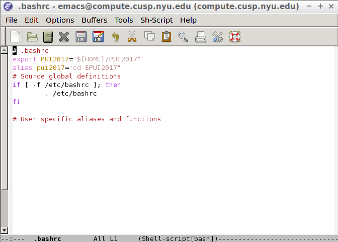
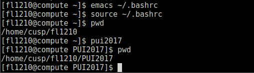

#PUI2017_fl1210
Create a directory on my workspace on CUSP compute named PUI2017.
Set the environmental variable PUI2017 and assocciated it to the directory above.

```
export PUI2017="{HOME}/PUI2017"
```
Create an alias pui2017 to move to the directory above using the env.variable $PUI2017.

```
alias pui2017="cd $PUI2017"
```
Save the setting in .bashrc.
Below is the screenshot of .bashrc file.


Now by typing pui2017 can move to the directory PUI2017.
Below is the screenshot of the terminal that shows the setting works.




